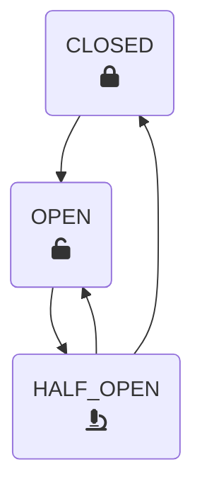
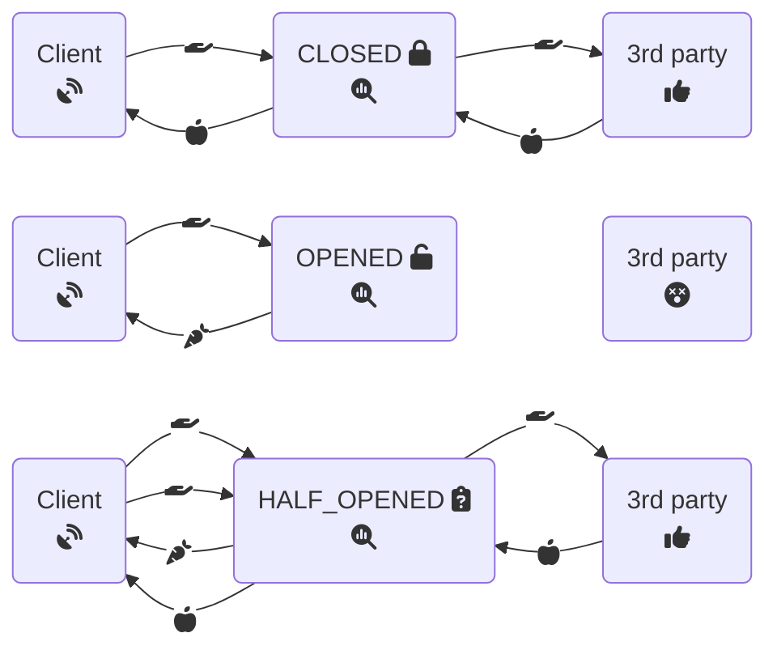

# Circuit Breaker States

## CLOSED
- default state
- pass through
- calculate failure rate

## OPEN
- triggered based on failure rate
- fallback procedure

## HALF_OPEN
- pass through for subset of calls
- calculate failure rate

