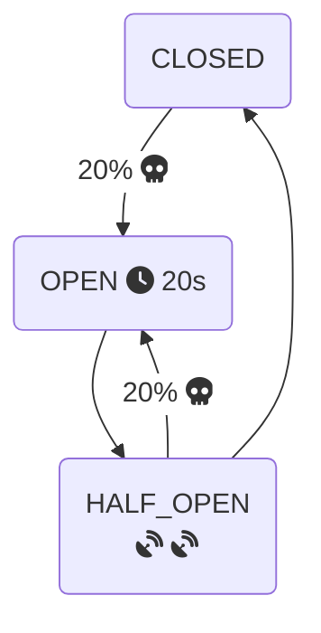
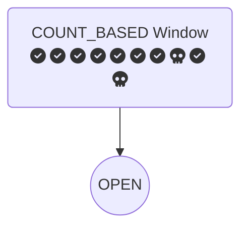
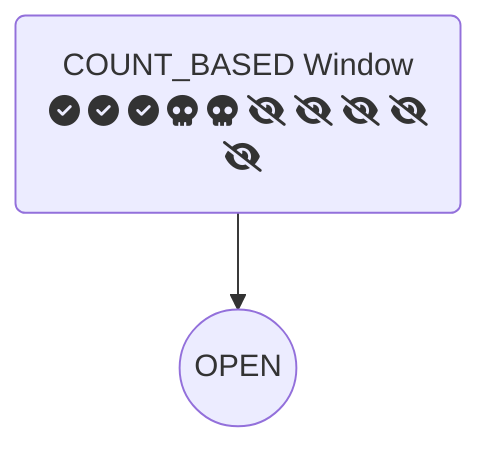

# Circuit Breaker State Transitions

## Configuration

Consider a set of the last 10 executions
- `slidingWindowSize` = 10
- `SlidingWindowType` = `COUNT_BASED` vs. `TIME_BASED`
- `minimumNumberOfCalls` = 5 (before the failure rate can be calculated)

When 20% (2/10) is considered slow (>= 100ms), transition to the `OPEN` state
- `slowCallRateThreshold` = 20
- `slowCallDurationThreshold` = 100ms

Stay in the `OPEN`state for 20 seconds
- `waitDurationInOpenState` = 20s

In `HALF-OPEN` state permit only 2 calls to calculate the state transition
- `permittedNumberOfCallsInHalfOpenState` = 2

